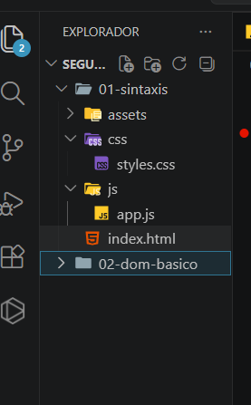
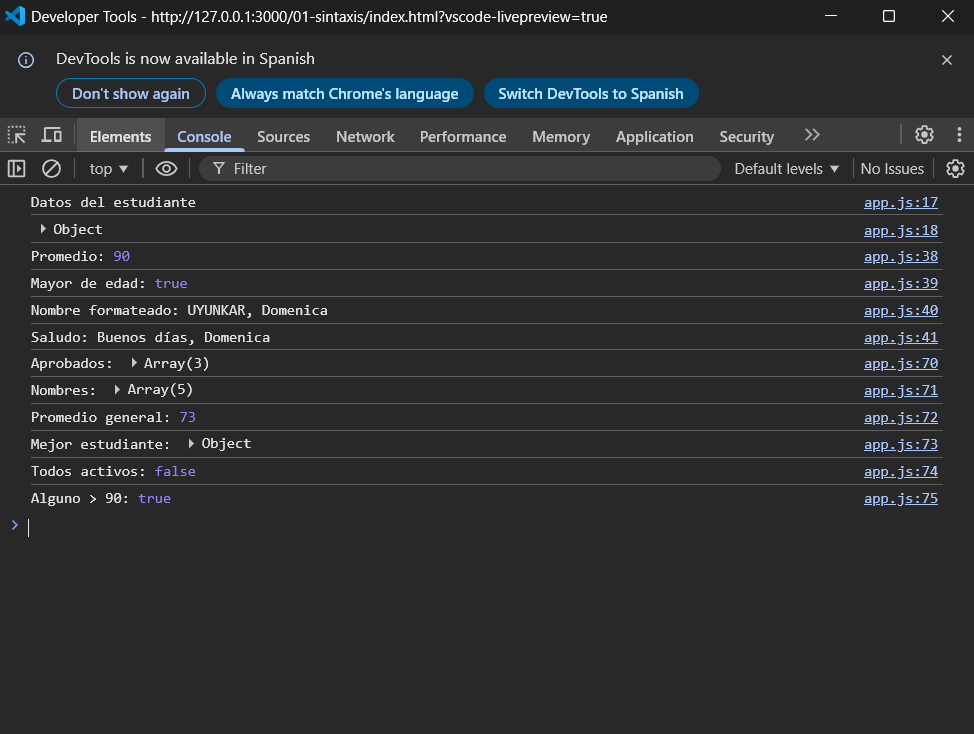
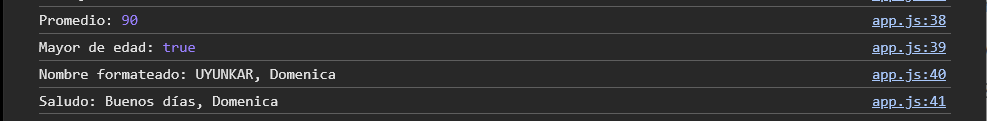
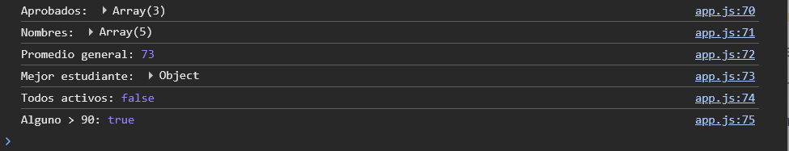
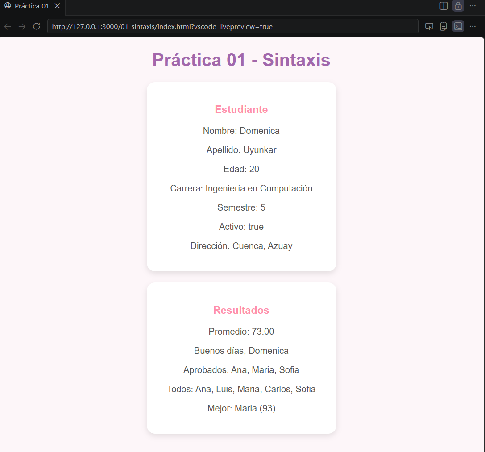

# Práctica 01 – Sintaxis JavaScript

---

## 1. Estructura del proyecto



**Descripción:**
Se muestra la organización del proyecto con el archivo principal `index.html`, la carpeta `css` para estilos, la carpeta `js` donde se encuentra `app.js`, y la carpeta `assets` donde se almacenan las capturas.

---

## 2. Consola: Variables y tipos



**Descripción:**
Se visualiza en consola la información del estudiante utilizando `console.log` y `console.table`, incluyendo nombre, apellido, edad, carrera, semestre, estado, materias y dirección.

---

## 3. Funciones de utilidad



**Descripción:**
Se muestran los resultados de las funciones implementadas como el cálculo del promedio, validación de mayoría de edad, formateo del nombre y generación de saludo.

---

## 4. Operaciones con arrays



**Descripción:**
Se presentan los resultados del uso de métodos como `filter`, `map`, `reduce`, `every` y `some` para manipular el arreglo de estudiantes.

---

## 5. Página renderizada



**Descripción:**
Se visualiza la información del estudiante y los resultados generados dinámicamente en el HTML mediante el uso del DOM.

---

## 6. Código fuente (app.js)

```javascript id="codigo-final"
'use strict';

const nombre = 'Domenica';
const apellido = 'Uyunkar';
let edad = 20;
const carrera = 'Ingeniería en Computación';
let semestre = 5;
const activo = true;
const materias = ['Redes', 'Programación', 'Base de Datos'];

const direccion = {
    ciudad: 'Cuenca',
    provincia: 'Azuay'
};

// Mostrar datos en consola
console.log('Datos del estudiante');
console.table({ nombre, apellido, edad, carrera, semestre, activo, materias, direccion });

// Función para calcular promedio
const calcularPromedio = (notas) => {
    const suma = notas.reduce((acc, nota) => acc + nota, 0);
    return suma / notas.length;
};

// Validar mayoría de edad
const esMayorDeEdad = (edad) => edad >= 18;

// Formatear nombre
const formatearNombre = (nombre, apellido) =>
    `${apellido.toUpperCase()}, ${nombre}`;

// Generar saludo
const generarSaludo = (nombre, hora) => {
    if (hora < 12) return `Buenos días, ${nombre}`;
    if (hora < 18) return `Buenas tardes, ${nombre}`;
    return `Buenas noches, ${nombre}`;
};

// Arreglo de estudiantes
const estudiantes = [
  { nombre: 'Ana', nota: 85, activo: true },
  { nombre: 'Luis', nota: 42, activo: true },
  { nombre: 'Maria', nota: 93, activo: false },
  { nombre: 'Carlos', nota: 67, activo: true },
  { nombre: 'Sofia', nota: 78, activo: true }
];

// Operaciones
const aprobados = estudiantes.filter(e => e.nota >= 70);
const nombres = estudiantes.map(e => e.nombre);
const promedioGeneral = estudiantes.reduce((acc, e) => acc + e.nota, 0) / estudiantes.length;
const mejor = estudiantes.reduce((max, e) => e.nota > max.nota ? e : max);

const todosActivos = estudiantes.every(e => e.activo);
const algunoMayor90 = estudiantes.some(e => e.nota > 90);
```

**Descripción:**
El archivo `app.js` contiene la lógica principal de la práctica, incluyendo la declaración de variables, funciones de utilidad, manipulación de arreglos y visualización de resultados tanto en consola como en el HTML.

---
