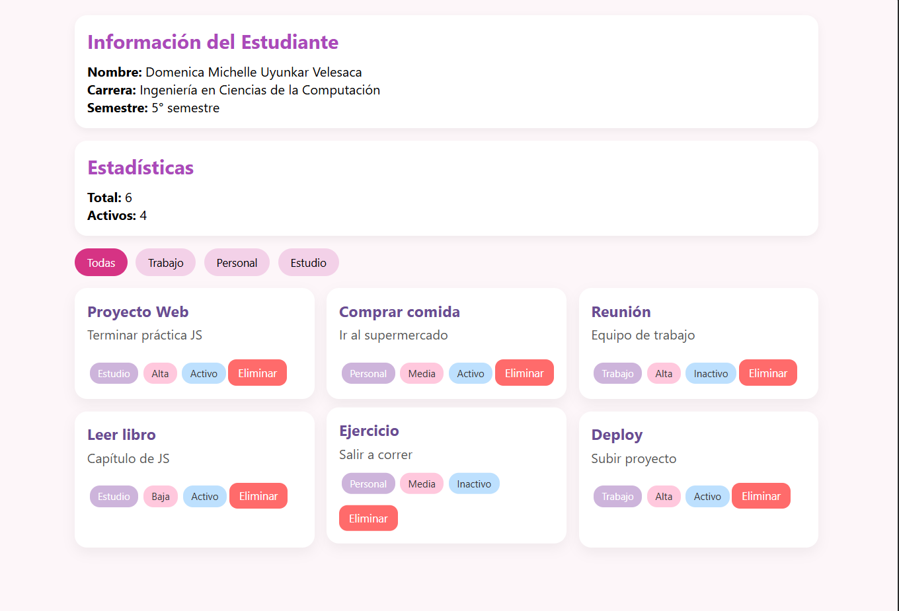
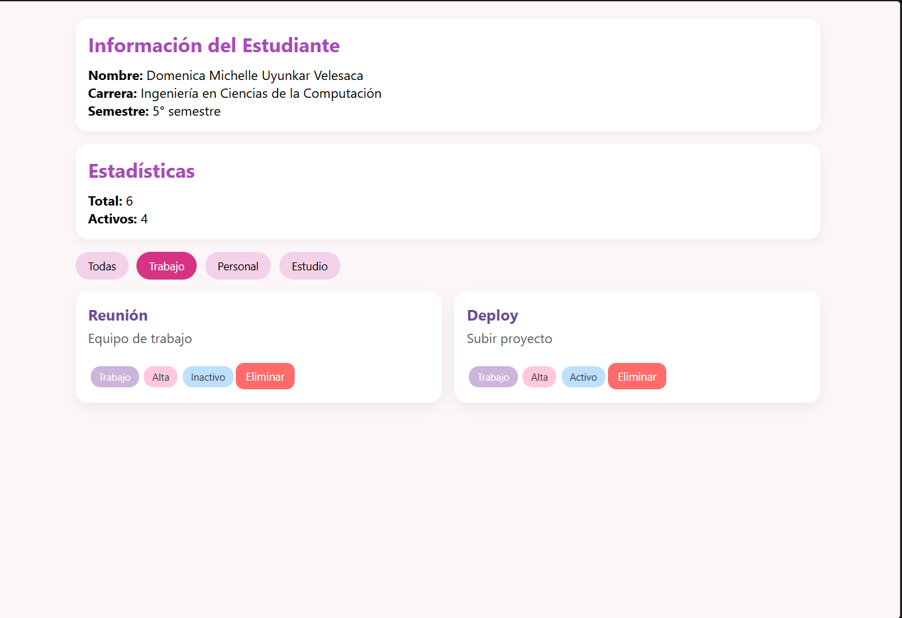

# Práctica 02 – Manipulación del DOM

---

## 1. Descripción

En esta práctica se desarrolló una aplicación web utilizando JavaScript para manipular el DOM dinámicamente.
Se implementó la visualización de información del estudiante, renderizado de una lista de elementos, filtrado por categoría y eliminación de elementos.

---

## 2. Funcionalidades principales

* Mostrar información del estudiante en el HTML
* Renderizar dinámicamente una lista de elementos
* Eliminar elementos de la lista
* Filtrar elementos por categoría
* Actualizar estadísticas en tiempo real

---

## 3. Código relevante

### 🔹 Renderizado de la lista

```javascript
function renderizarLista(datos) {
  const contenedor = document.getElementById('contenedor-lista');
  contenedor.innerHTML = '';

  const fragment = document.createDocumentFragment();

  datos.forEach(el => {
    const card = document.createElement('div');
    card.classList.add('card');

    const titulo = document.createElement('h3');
    titulo.textContent = el.titulo;

    const descripcion = document.createElement('p');
    descripcion.textContent = el.descripcion;

    const btnEliminar = document.createElement('button');
    btnEliminar.textContent = 'Eliminar';

    btnEliminar.addEventListener('click', () => {
      eliminarElemento(el.id);
    });

    card.appendChild(titulo);
    card.appendChild(descripcion);
    card.appendChild(btnEliminar);

    fragment.appendChild(card);
  });

  contenedor.appendChild(fragment);
}
```

---

### 🔹 Eliminación de elementos

```javascript
function eliminarElemento(id) {
  const index = elementos.findIndex(el => el.id === id);
  if (index !== -1) {
    elementos.splice(index, 1);
    renderizarLista(elementos);
  }
}
```

---

### 🔹 Filtrado de elementos

```javascript
function inicializarFiltros() {
  const botones = document.querySelectorAll('.btn-filtro');

  botones.forEach(btn => {
    btn.addEventListener('click', () => {
      const categoria = btn.dataset.categoria;

      if (categoria === 'todas') {
        renderizarLista(elementos);
      } else {
        const filtrados = elementos.filter(e => e.categoria === categoria);
        renderizarLista(filtrados);
      }
    });
  });
}
```

---

## 4. Evidencias

### 🔹 Vista general



**Descripción:**
Se muestra la interfaz completa de la aplicación con la lista de elementos, información del estudiante y estadísticas.

---

### 🔹 Filtrado



**Descripción:**
Se visualiza el funcionamiento del filtro por categoría, mostrando únicamente los elementos correspondientes.

---

## 5. Conclusión

Se logró implementar correctamente la manipulación del DOM mediante JavaScript, permitiendo crear interfaces dinámas, interactivas y actualizadas en tiempo real sin el uso de frameworks.

---
