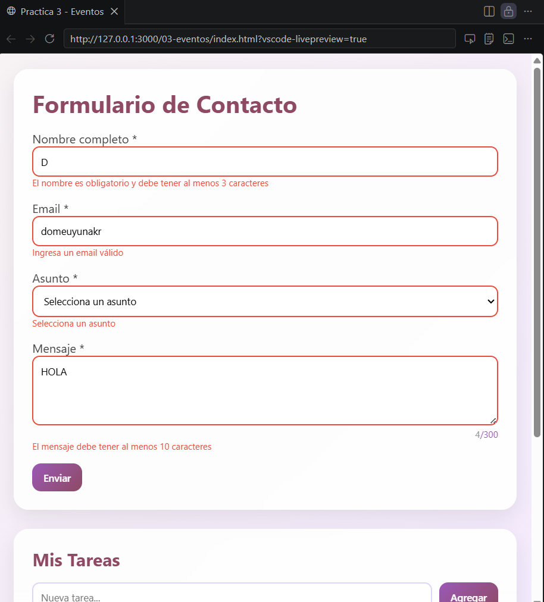
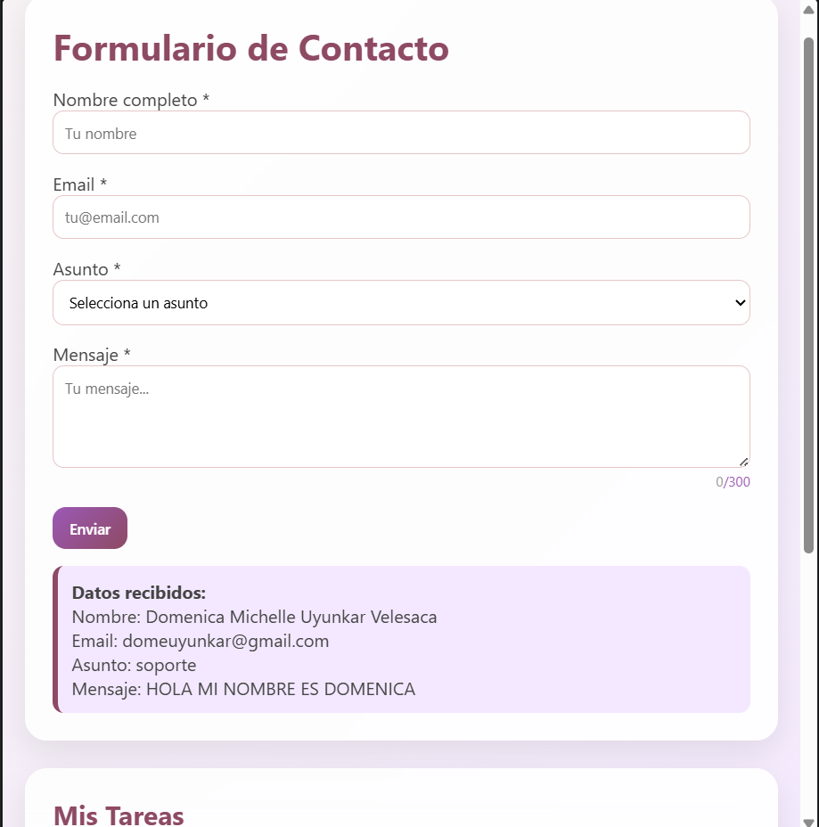
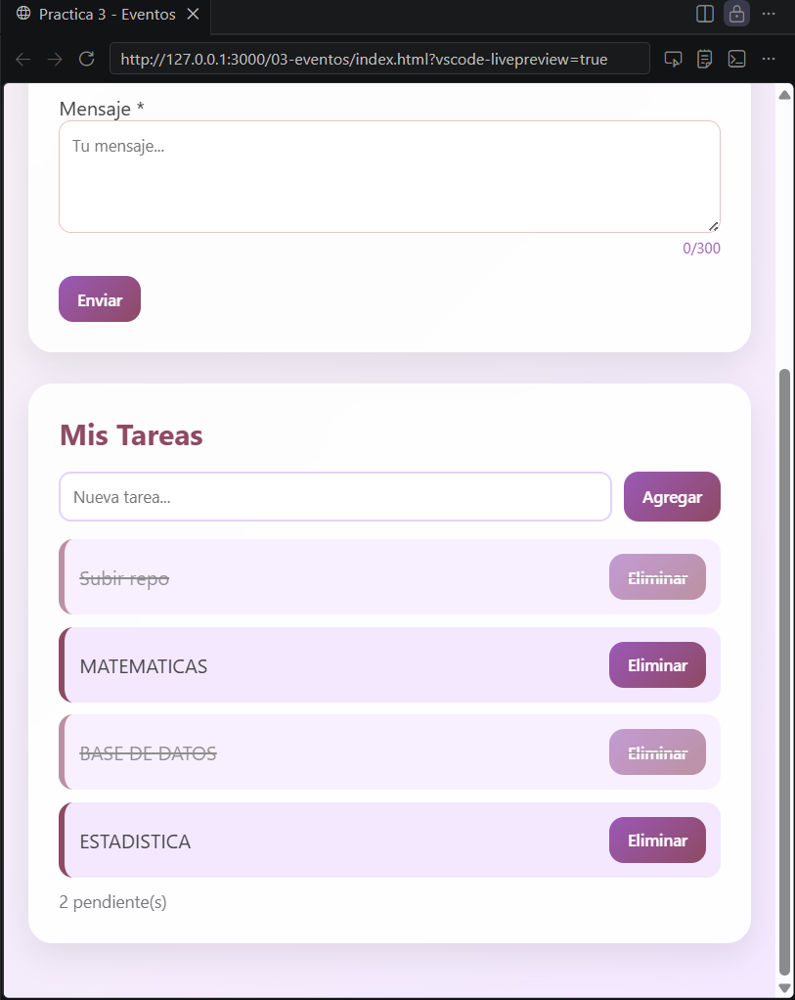
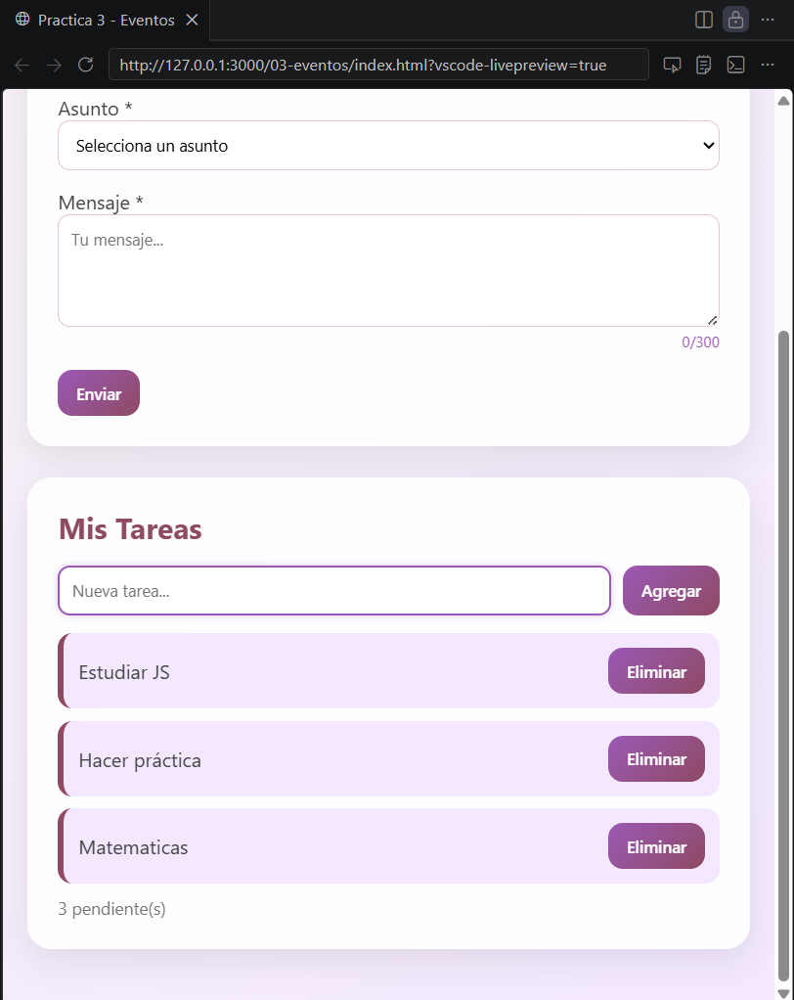
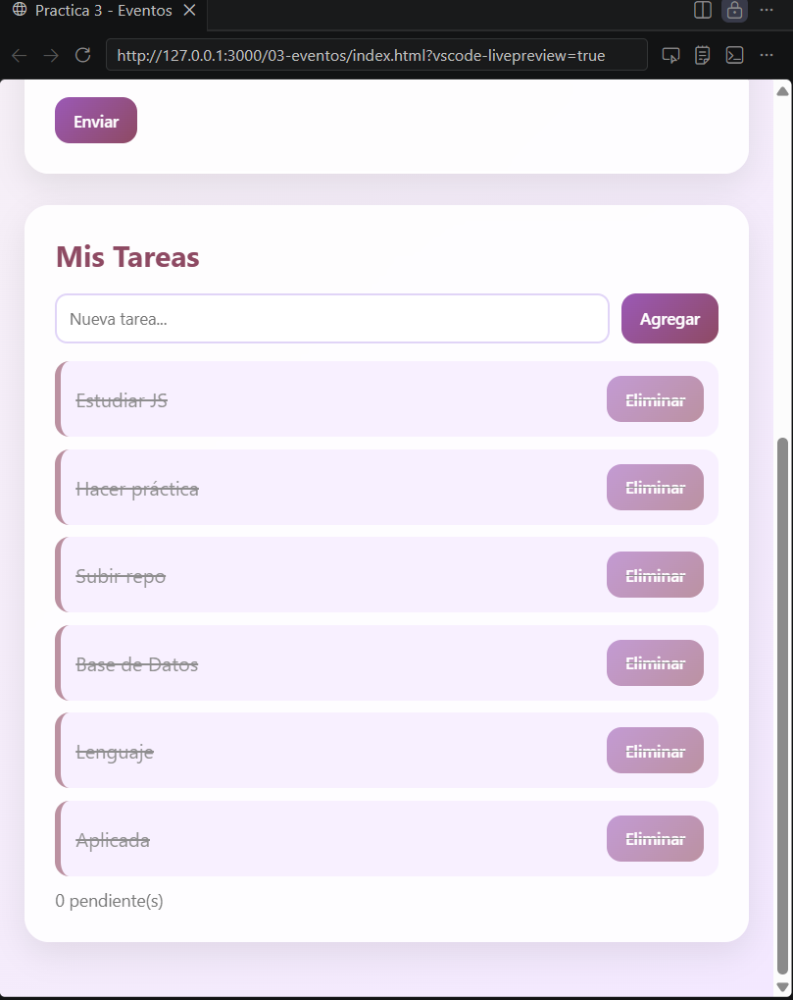

# Práctica 3 - Eventos 

##  Descripción

En esta práctica se desarrolló una aplicación web utilizando **JavaScript** enfocada en el manejo de eventos del DOM.

La solución implementada consta de dos módulos principales:

*  **Formulario de contacto con validación en tiempo real**
*  **Sistema de gestión de tareas dinámico**

Se aplicaron conceptos como validación de datos, manipulación del DOM, control de eventos y mejoras en la experiencia de usuario.

---

## Funcionalidades implementadas

###  Formulario de contacto

* Validación en tiempo real mediante eventos `blur` e `input`
* Validación de email usando expresiones regulares
* Contador de caracteres dinámico en el mensaje
* Manejo de errores visuales
* Envío controlado con `preventDefault()`
* Atajo de teclado con **Ctrl + Enter**

###  Sistema de tareas

* Agregar nuevas tareas dinámicamente
* Marcar tareas como completadas
* Eliminar tareas
* Contador automático de tareas pendientes
* Uso de **delegación de eventos** para optimizar el manejo de clics

---

##  Código destacado

### 🔹 Validación del formulario con preventDefault()

```js
formulario.addEventListener('submit', (e) => {
  e.preventDefault();

  const nombreValido = validarNombre();
  const emailValido = validarEmail();
  const asuntoValido = validarAsunto();
  const mensajeValido = validarMensaje();

  if (nombreValido && emailValido && asuntoValido && mensajeValido) {
    mostrarResultado();
    resetearFormulario();
    return;
  }

  if (!nombreValido) return inputNombre.focus();
  if (!emailValido) return inputEmail.focus();
  if (!asuntoValido) return selectAsunto.focus();

  textMensaje.focus();
});
```

---

### 🔹 Delegación de eventos en la lista de tareas

```js
listaTareas.addEventListener('click', (e) => {
  const action = e.target.dataset.action;
  if (!action) return;

  const li = e.target.closest('li');
  const id = Number(li.dataset.id);

  if (action === 'eliminar') {
    tareas = tareas.filter(t => t.id !== id);
  }

  if (action === 'toggle') {
    const tarea = tareas.find(t => t.id === id);
    tarea.completada = !tarea.completada;
  }

  renderizarTareas();
});
```

---

### 🔹 Atajo de teclado (Ctrl + Enter)

```js
document.addEventListener('keydown', (e) => {
  if (e.ctrlKey && e.key === 'Enter') {
    e.preventDefault();
    formulario.requestSubmit();
  }
});
```

---

##  Evidencias

###  Validación en acción



**Descripción:** Se muestran los mensajes de error cuando los campos no cumplen con las condiciones establecidas.

---

###  Formulario procesado



**Descripción:** El formulario se envía correctamente cuando todos los campos son válidos y se muestran los datos ingresados.

---

###  Delegación de eventos



**Descripción:** Se evidencia la funcionalidad de eliminar tareas y marcar tareas como completadas mediante delegación de eventos.

---

###  Contador de tareas



**Descripción:** El contador se actualiza automáticamente al agregar o eliminar tareas.

---

###  Tareas completadas



**Descripción:** Las tareas completadas se muestran visualmente tachadas, indicando su estado.

---


