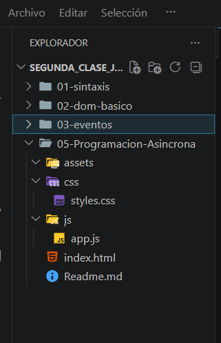
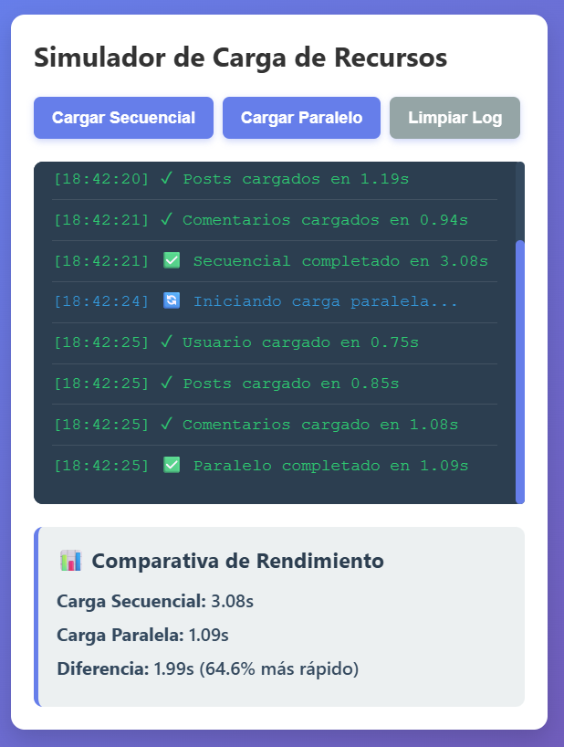
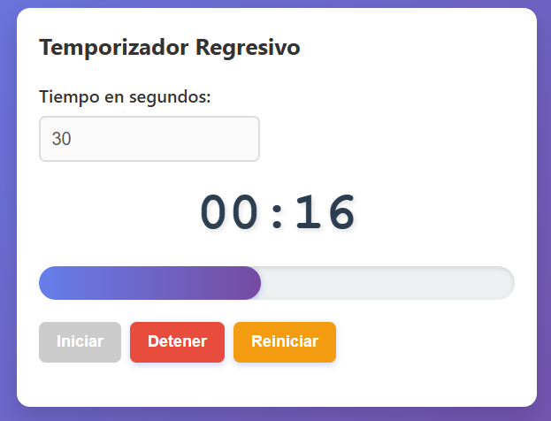
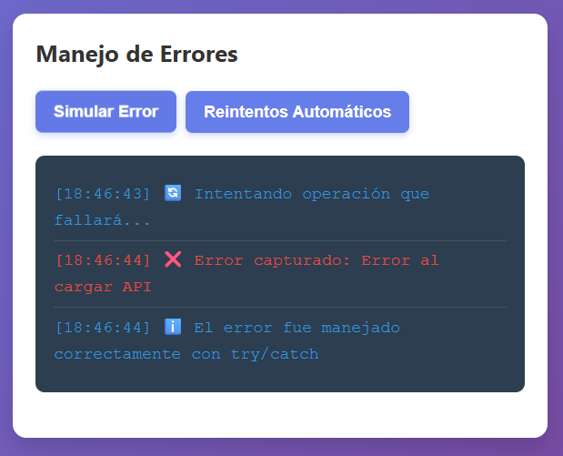
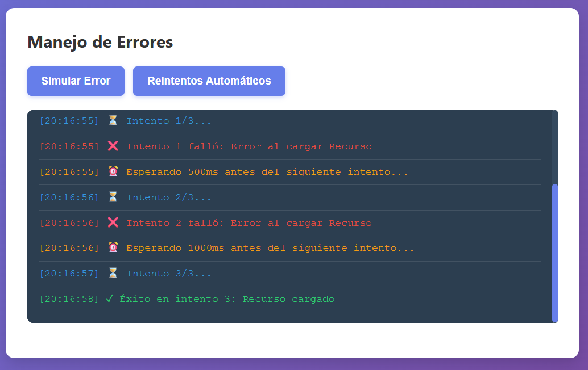
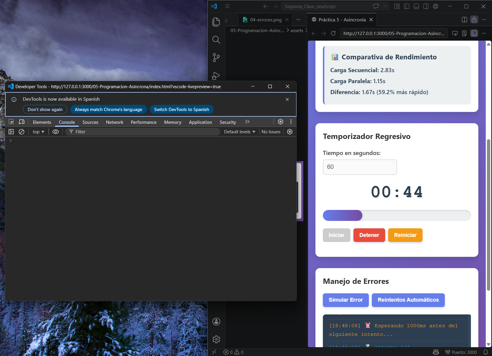

# Práctica 05 - Asincronía  

## Descripción  

En esta práctica se desarrolló una aplicación web utilizando **JavaScript** enfocada en el manejo de la **asincronía**.

La solución implementada consta de tres módulos principales:

* **Simulador de carga de recursos (secuencial vs paralelo)**  
* **Temporizador regresivo interactivo**  
* **Sistema de manejo de errores con reintentos**  

Se aplicaron conceptos como Promesas, `async/await`, `Promise.all`, temporizadores y control de errores.

---


## Funcionalidades implementadas  

### Simulador de carga  

* Simulación de peticiones usando `Promise` y `setTimeout`  
* Ejecución **secuencial** con `await`  
* Ejecución **paralela** con `Promise.all()`  
* Comparación de tiempos entre ambos métodos  
* Registro de eventos en un log dinámico  

---

## Funcionalidades implementadas  

### Simulador de carga  

* Simulación de peticiones usando `Promise` y `setTimeout`  
* Ejecución **secuencial** con `await`  
* Ejecución **paralela** con `Promise.all()`  
* Comparación de tiempos entre ambos métodos  
* Registro de eventos en un log dinámico  

---

### Temporizador  

* Ingreso de tiempo en segundos  
* Visualización en formato **MM:SS**  
* Barra de progreso animada  
* Cambio de estado visual en los últimos 10 segundos  
* Controles de iniciar, detener y reiniciar  

---

### Manejo de errores  

* Simulación de errores en promesas  
* Captura de errores con `try/catch`  
* Sistema de reintentos automáticos  
* Backoff exponencial entre intentos  
* Registro de errores en pantalla  

---

## Código destacado  

## 💻 Código destacado

### 🔹 Función de simulación

```javascript
function simularPeticion(nombre, tiempoMin, tiempoMax, fallar) {
  return new Promise((resolve, reject) => {
    const tiempoDelay = Math.random() * (tiempoMax - tiempoMin) + tiempoMin;

    setTimeout(() => {
      if (fallar) reject(new Error("Error al cargar " + nombre));
      else resolve({ nombre, tiempo: tiempoDelay });
    }, tiempoDelay);
  });
}
```
----
### 🔹 Carga Secuencial
```javascript

const usuario = await simularPeticion('Usuario');
const posts = await simularPeticion('Posts');
const comentarios = await simularPeticion('Comentarios');
```

---

### 🔹 Carga Paralela
```javascript
const promesas = [
  simularPeticion('Usuario'),
  simularPeticion('Posts'),
  simularPeticion('Comentarios')
];

const resultados = await Promise.all(promesas);
```

---
### 🔹 Temporizador
```javascript
intervaloId = setInterval(() => {
  tiempoRestante--;
  actualizarDisplay();
}, 1000);
```
---

### 🔹 Manejo de errores
```javascript
try {
  await simularPeticion('API', 500, 1000, true);
} catch (error) {
  console.log(error.message);
}
```
### 🔹 Reintentos automáticos
```javascript
await new Promise(resolve =>
  setTimeout(resolve, 500 * Math.pow(2, i))
);
```


### Estructura del proyecto


**Descripción:** Se muestra la organización del proyecto con sus carpetas principales: HTML, CSS, JavaScript y assets para las evidencias.

---

### Carga secuencial vs paralela



**Descripción:** La carga secuencial ejecuta las peticiones una tras otra utilizando await, por lo que el tiempo total es la suma de todos los delays (aprox. 4 a 5 segundos). En cambio, la carga paralela usa Promise.all(), ejecutando todas las peticiones al mismo tiempo, reduciendo el tiempo a aproximadamente 1 a 2 segundos.

---

### Temporizador en acción



**Descripción:** Se muestra el temporizador funcionando con actualización en tiempo real en formato MM:SS. La barra de progreso avanza conforme pasa el tiempo y cambia a color rojo cuando quedan 10 segundos o menos, indicando estado de alerta.

---

### Manejo de errores





**Descripción:** Se simula un error en una petición utilizando reject y se captura correctamente con try/catch. Además, se implementan reintentos automáticos cuando una operación falla.

---

### Consola sin errores



**Descripción:** Se verifica que la aplicación se ejecuta correctamente sin errores en la consola del navegador, confirmando que todas las promesas y eventos fueron manejados adecuadamente.


