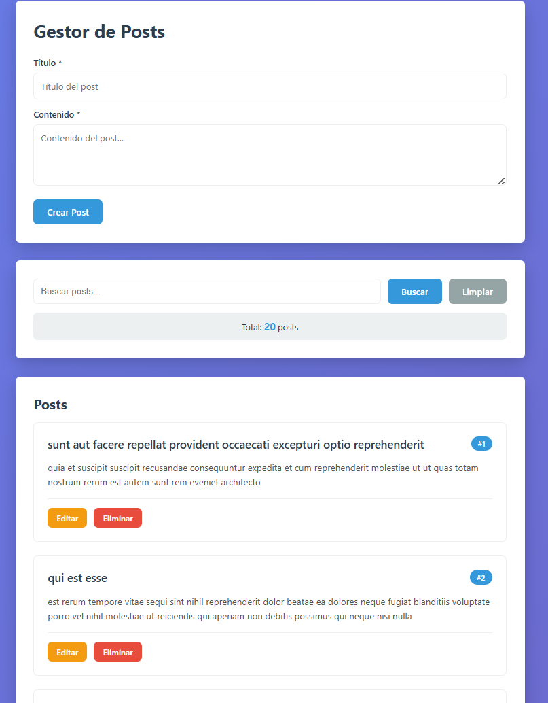
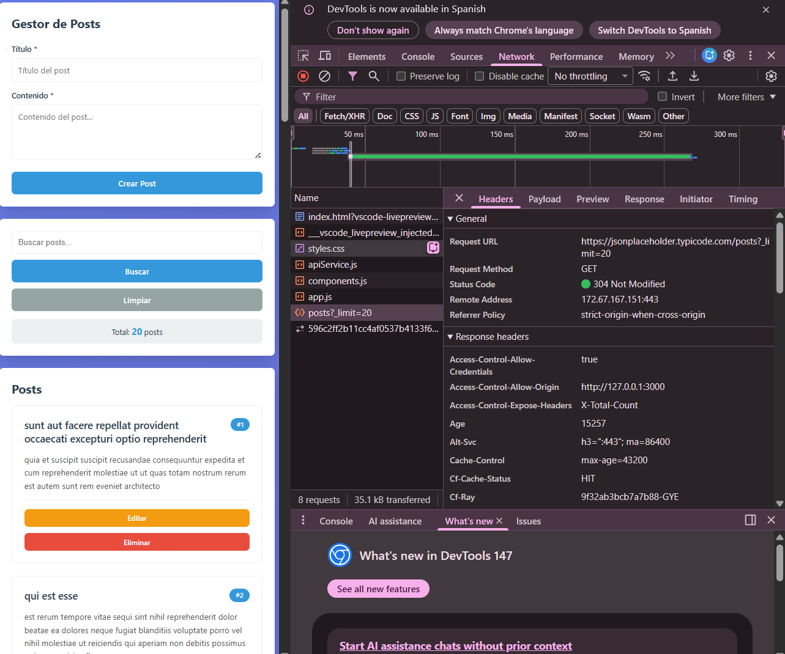
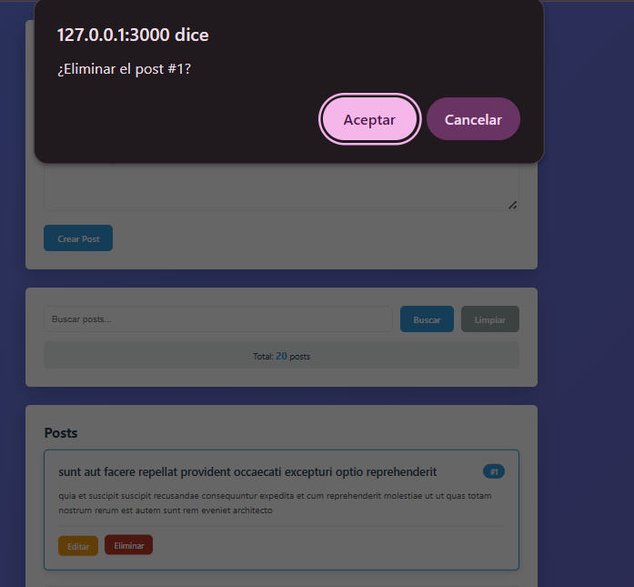
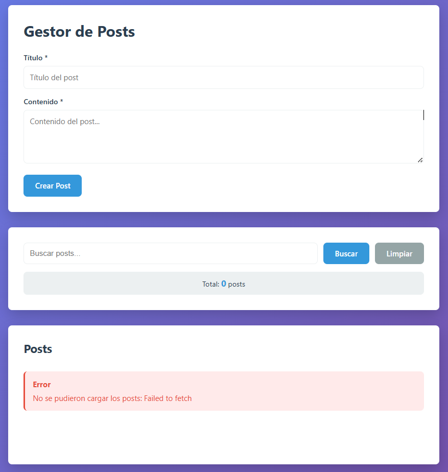
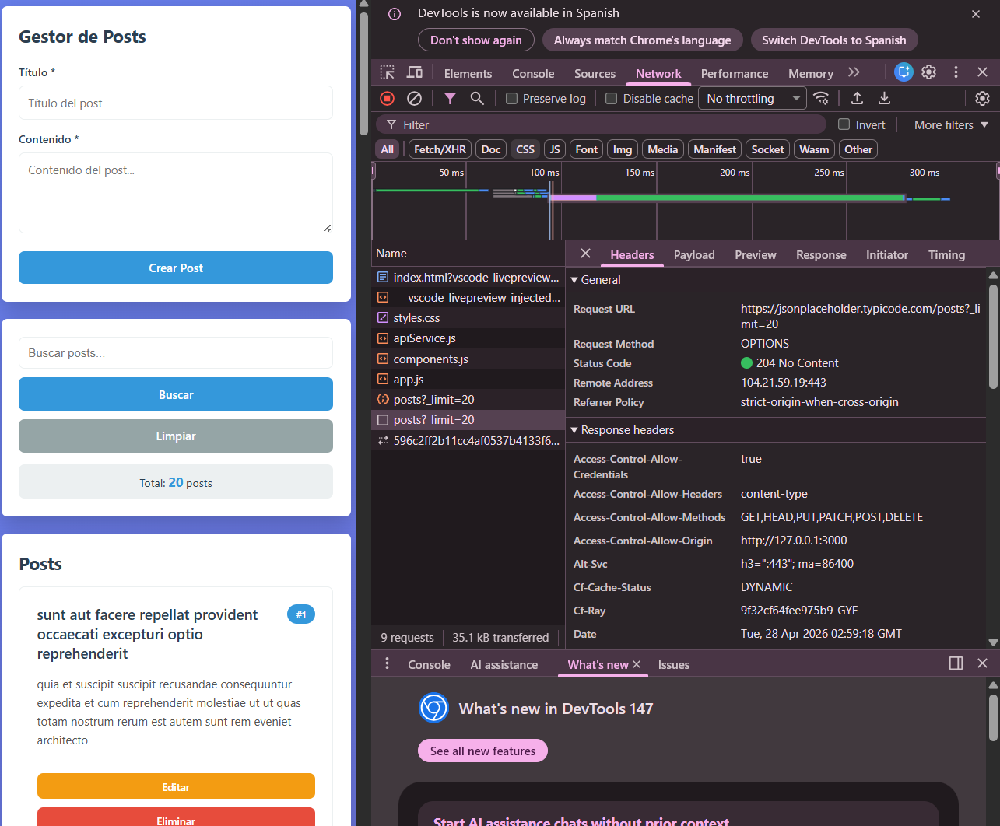

# Práctica 6 - Fetch API

En esta sección se presenta la implementación del servicio API, el cual centraliza las peticiones HTTP utilizando Fetch API y async/await.

## 1. Datos cargados desde la API


**Descripción:** Se obtienen 20 registros desde la API JSONPlaceholder mediante una petición GET y se renderizan dinámicamente en la interfaz.

---

## 2. Spinner de carga


**Descripción:** Se muestra un indicador visual de carga mientras se obtienen los datos desde la API.

---

## 3. Crear Post


**Descripción:** Se envía un nuevo post mediante una petición POST y se agrega dinámicamente a la lista.

---

## 4. Editar Post


**Descripción:** Se actualiza un post existente mediante una petición PUT y se refleja el cambio en la interfaz.

---

## 5. Eliminar Post


**Descripción:** Se elimina un post mediante una petición DELETE y se actualiza la lista.

---

## 6. Manejo de errores


**Descripción:** Se muestra un mensaje de error en la UI cuando falla la conexión con la API.

---

## 7. DevTools Network


**Descripción:** En la pestaña Network se observan las peticiones HTTP (GET, POST, PUT, DELETE) realizadas a la API.

---

## 8. Código del servicio API

```js

const ApiService = {
  baseUrl: 'https://jsonplaceholder.typicode.com',

  async request(endpoint, options = {}) {
    const url = `${this.baseUrl}${endpoint}`;

    const config = {
      headers: {
        'Content-Type': 'application/json',
        ...options.headers
      },
      ...options
    };

    const response = await fetch(url, config);

    if (!response.ok) {
      throw new Error(`HTTP Error: ${response.status}`);
    }

    if (response.status === 204) return null;

    return await response.json();
  },

  async getPosts(limit = 10) {
    return this.request(`/posts?_limit=${limit}`);
  },

  async createPost(postData) {
    return this.request('/posts', {
      method: 'POST',
      body: JSON.stringify(postData)
    });
  }
};

```
**Descripción:** Implementación del servicio que centraliza las peticiones HTTP utilizando Fetch API.

---

## 🔹 9. Código de componentes


```js

function PostCard(post) {
  const article = document.createElement('article');
  article.className = 'post-card';

  const title = document.createElement('h3');
  title.textContent = post.title;

  const body = document.createElement('p');
  body.textContent = post.body;

  article.appendChild(title);
  article.appendChild(body);

  return article;
}

```
**Descripción:** Componentes construidos con createElement, textContent y appendChild para manipulación segura del DOM.