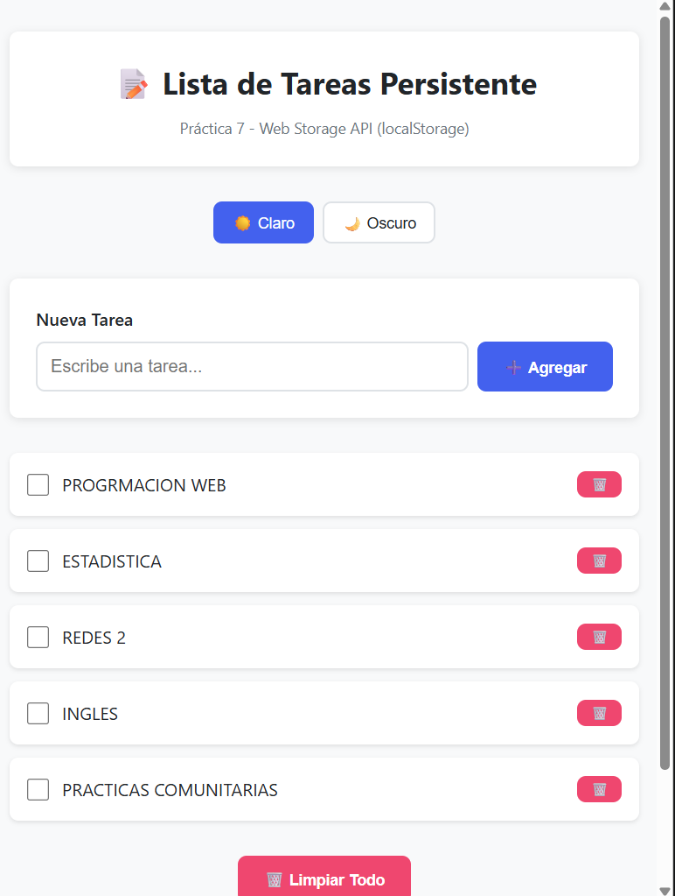
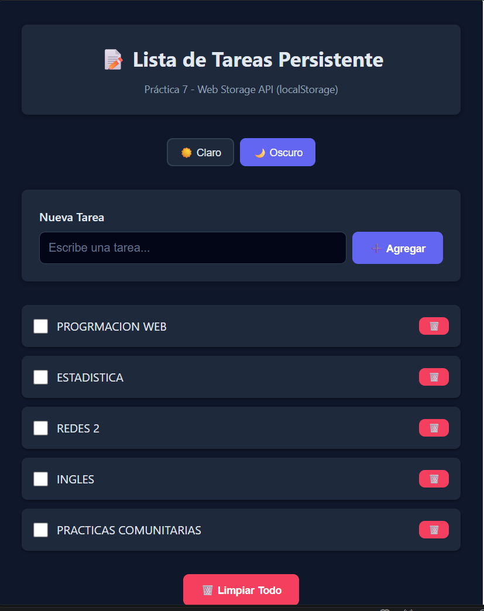
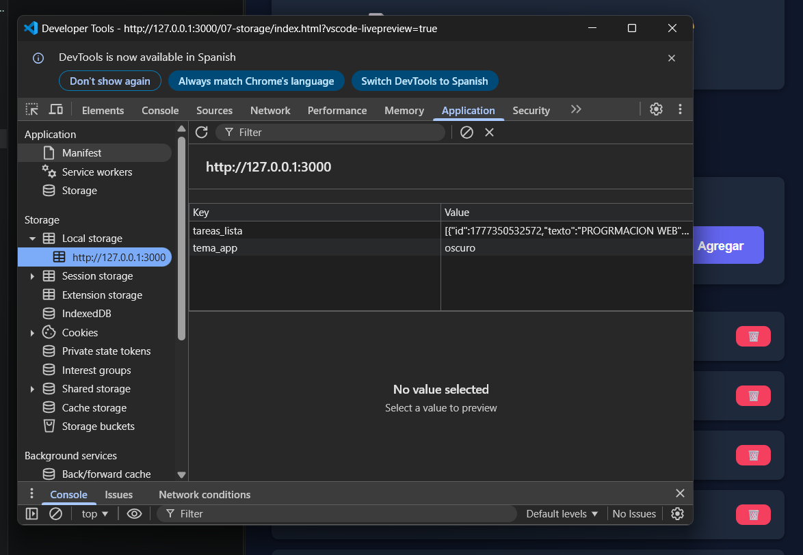

# Práctica 7 - Storage


### 1. Lista con datos persistentes

**Descripción:** Se crearon varias tareas y se muestran en la interfaz.

### 2. Persistencia

**Descripción:** Al recargar la página, las tareas permanecen gracias a localStorage.

### 3. Tema oscuro

**Descripción:** Se aplica el tema oscuro y se guarda en localStorage.

### 4. DevTools - Local Storage

**Descripción:** Se observan las claves `tareas_lista` y `tema_app`.

### 5. Código - storage.js

```js

'use strict';

const TareaStorage = {
  CLAVE: 'tareas_lista',

  getAll() {
    try {
      const datos = localStorage.getItem(this.CLAVE);
      if (!datos) return [];
      return JSON.parse(datos);
    } catch (error) {
      console.error('Error al leer tareas:', error);
      return [];
    }
  },

  guardar(tareas) {
    try {
      localStorage.setItem(this.CLAVE, JSON.stringify(tareas));
    } catch (error) {
      console.error('Error al guardar tareas:', error);
    }
  },

  crear(texto) {
    const tareas = this.getAll();

    const nueva = {
      id: Date.now(),
      texto: texto.trim(),
      completada: false
    };

    tareas.push(nueva);
    this.guardar(tareas);

    return nueva;
  },

  toggleCompletada(id) {
    const tareas = this.getAll();
    const tarea = tareas.find(t => t.id === id);

    if (tarea) {
      tarea.completada = !tarea.completada;
      this.guardar(tareas);
    }
  },

  eliminar(id) {
    const tareas = this.getAll();
    const filtradas = tareas.filter(t => t.id !== id);
    this.guardar(filtradas);
  },

  limpiarTodo() {
    localStorage.removeItem(this.CLAVE);
  }
};

const TemaStorage = {
  CLAVE: 'tema_app',

  getTema() {
    return localStorage.getItem(this.CLAVE) || 'claro';
  },

  setTema(tema) {
    localStorage.setItem(this.CLAVE, tema);
  }
};
```
**Descripción:** Implementación del servicio de almacenamiento.


### 6. Código - app.js

```js
'use strict';

const formTarea = document.getElementById('form-tarea');
const inputTarea = document.getElementById('input-tarea');
const listaTareas = document.getElementById('lista-tareas');
const mensajeEstado = document.getElementById('mensaje-estado');
const btnLimpiar = document.getElementById('btn-limpiar');
const themeBtns = document.querySelectorAll('[data-theme]');

let tareas = [];

function crearElementoTarea(tarea) {
  const li = document.createElement('li');
  li.className = 'task-item';
  li.dataset.id = tarea.id;

  if (tarea.completada) {
    li.classList.add('task-item--completed');
  }

  const checkbox = document.createElement('input');
  checkbox.type = 'checkbox';
  checkbox.checked = tarea.completada;

  const span = document.createElement('span');
  span.textContent = tarea.texto;

  const btnEliminar = document.createElement('button');
  btnEliminar.textContent = '🗑️';

  const divAcciones = document.createElement('div');
  divAcciones.appendChild(btnEliminar);

  li.appendChild(checkbox);
  li.appendChild(span);
  li.appendChild(divAcciones);

  checkbox.addEventListener('change', () => toggleTarea(tarea.id));
  btnEliminar.addEventListener('click', () => eliminarTarea(tarea.id));

  return li;
}

function renderizarTareas() {
  listaTareas.innerHTML = '';

  if (tareas.length === 0) {
    const p = document.createElement('p');
    p.textContent = '🎉 No hay tareas';
    listaTareas.appendChild(p);
    return;
  }

  tareas.forEach(t => {
    listaTareas.appendChild(crearElementoTarea(t));
  });
}

function mostrarMensaje(texto, tipo = 'success') {
  mensajeEstado.textContent = texto;
  mensajeEstado.className = `mensaje mensaje--${tipo}`;
  mensajeEstado.classList.remove('oculto');

  setTimeout(() => {
    mensajeEstado.classList.add('oculto');
  }, 3000);
}

function cargarTareas() {
  tareas = TareaStorage.getAll();
  renderizarTareas();
}

function agregarTarea(texto) {
  if (!texto.trim()) return;

  TareaStorage.crear(texto);
  tareas = TareaStorage.getAll();
  renderizarTareas();

  mostrarMensaje('Tarea agregada');
}

function toggleTarea(id) {
  TareaStorage.toggleCompletada(id);
  tareas = TareaStorage.getAll();
  renderizarTareas();
}

function eliminarTarea(id) {
  TareaStorage.eliminar(id);
  tareas = TareaStorage.getAll();
  renderizarTareas();
}

function limpiarTodo() {
  TareaStorage.limpiarTodo();
  tareas = [];
  renderizarTareas();
}

function aplicarTema(nombreTema) {
  if (nombreTema === 'oscuro') {
    document.body.classList.add('tema-oscuro');
  } else {
    document.body.classList.remove('tema-oscuro');
  }

  TemaStorage.setTema(nombreTema);
}

formTarea.addEventListener('submit', e => {
  e.preventDefault();
  agregarTarea(inputTarea.value);
  inputTarea.value = '';
});

btnLimpiar.addEventListener('click', limpiarTodo);

themeBtns.forEach(btn => {
  btn.addEventListener('click', () => aplicarTema(btn.dataset.theme));
});

aplicarTema(TemaStorage.getTema());
cargarTareas();

```
**Descripción:** Lógica de renderizado y eventos.