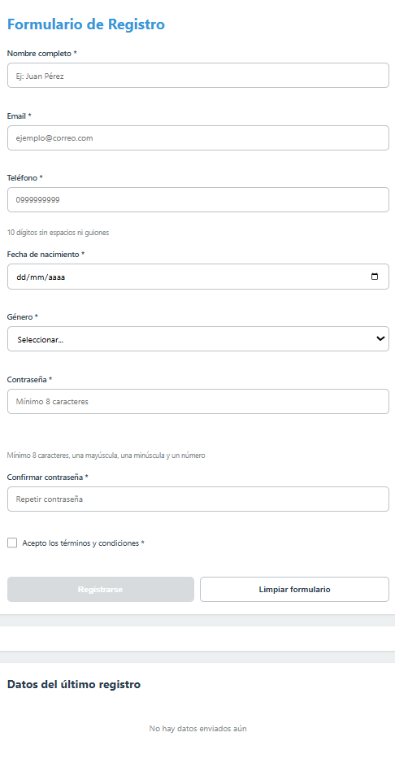
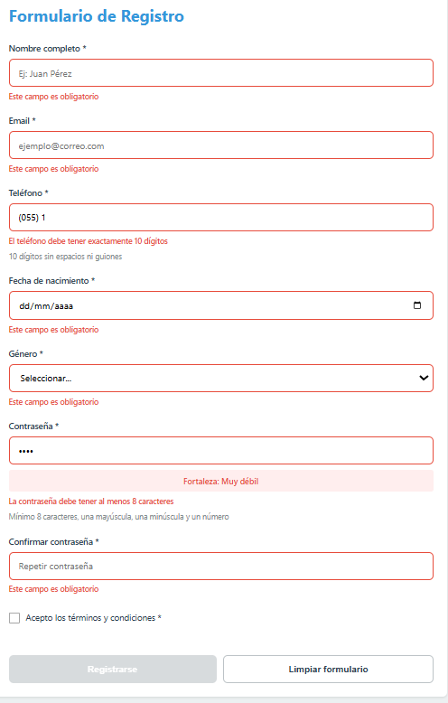
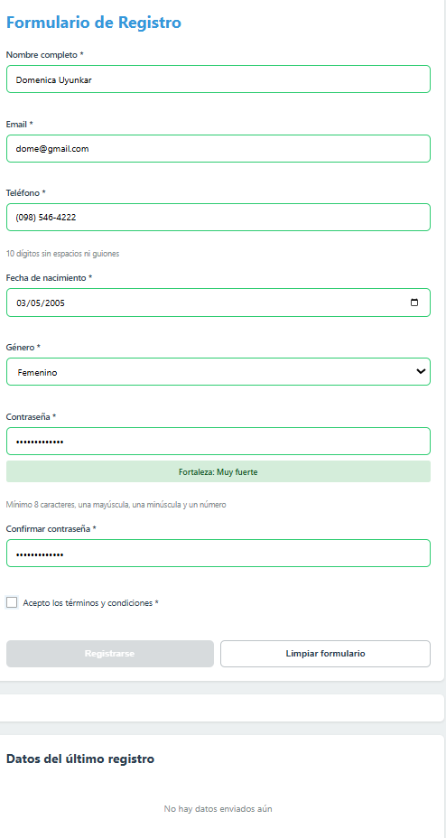
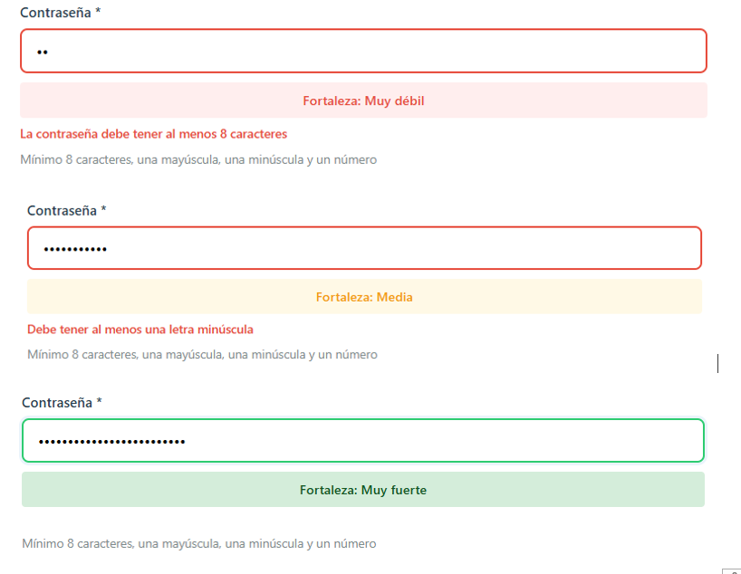
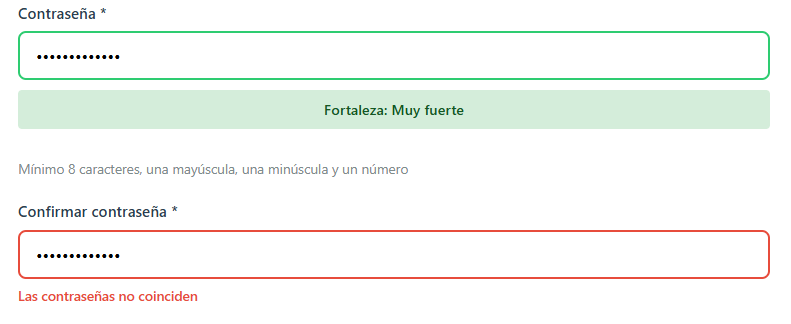
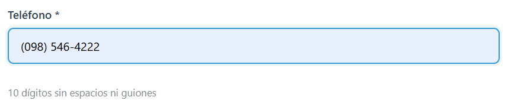
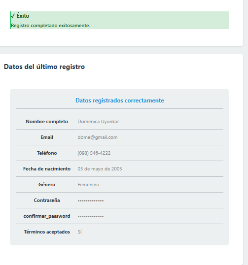
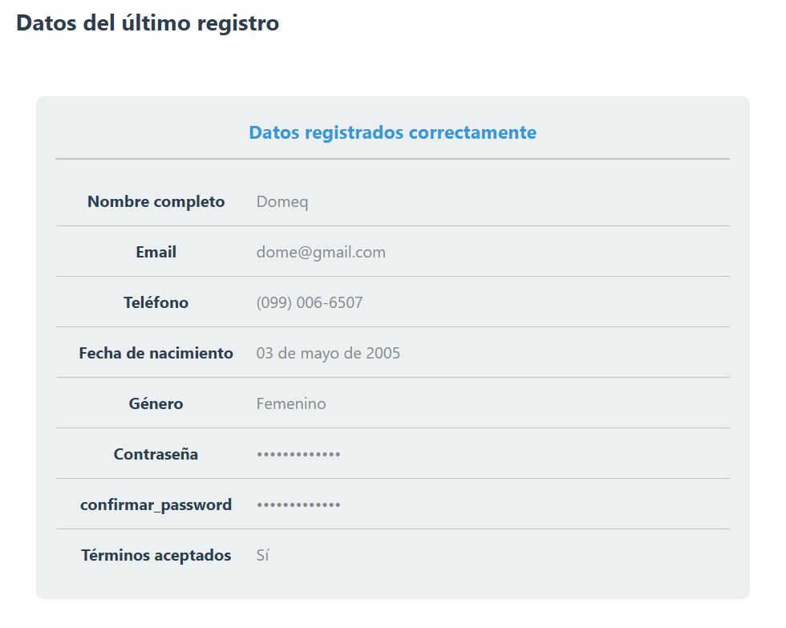
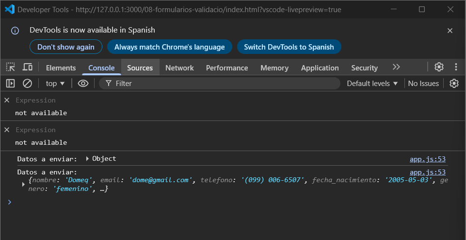

# Práctica 8 - Formularios y Validación

## Descripción
Aplicación web desarrollada en HTML, CSS y JavaScript puro que implementa un formulario de registro con validación completa en tiempo real.

---

## 📸 Evidencias

### 1. Formulario vacío con botón deshabilitado

**Descripción:** Vista inicial del formulario sin datos.

### 2. Formulario con errores de validación

**Descripción:** Se muestran mensajes de error específicos por cada campo al ingresar datos inválidos.

### 3. Campos válidos

**Descripción:** Feedback visual (bordes verdes) cuando los datos ingresados cumplen las reglas.

### 4. Indicador de fuerza de contraseña

**Descripción:** El indicador reacciona en tiempo real evaluando la seguridad de la contraseña.

### 5. Error en confirmación de contraseña

**Descripción:** Validación estricta para asegurar que ambas contraseñas coincidan.

### 6. Máscara de teléfono

**Descripción:** Formateo automático a (099) 999-9999 mientras el usuario escribe.

### 7. Envío exitoso

**Descripción:** Mensaje verde y tarjeta con datos.

### 8. Tarjeta de resultado y envío exitoso

**Descripción:** Mensaje de éxito y datos renderizados de forma segura en el DOM tras un envío válido.

### 8. Datos en consola

**Descripción:** Comprobación de la captura de los datos procesados mediante FormData.

---

## Evidencias y Fragmentos de Código

### 1. Creación segura de Componentes del DOM (Sin innerHTML)
Para prevenir vulnerabilidades XSS, todos los componentes se construyen utilizando la API nativa del DOM (`createElement`, `textContent`, `appendChild`).

**Componente de Mensajes:**
```javascript
function MensajeExito(mensaje) {
  const container = document.createElement('div');
  container.className = 'mensaje-exito';

  const titulo = document.createElement('strong');
  titulo.textContent = '✓ Éxito';

  const texto = document.createElement('p');
  texto.textContent = mensaje;

  container.appendChild(titulo);
  container.appendChild(texto);

  return container;
}
```
---
### 2. Funciones de Validación
El sistema evalúa reglas dinámicas dependiendo del tipo de input, utilizando expresiones regulares y cálculos de fechas.
```javascript
case 'fecha_nacimiento':
  const fechaNac = new Date(valor);
  const hoy = new Date();
  let edad = hoy.getFullYear() - fechaNac.getFullYear();
  const mes = hoy.getMonth() - fechaNac.getMonth();

  if (mes < 0 || (mes === 0 && hoy.getDate() < fechaNac.getDate())) {
    edad--;
  }

  if (edad < 18) {
    error = 'Debes ser mayor de 18 años';
  } else if (edad > 120) {
    error = 'Fecha de nacimiento inválida';
  }
  break;

case 'password':
  if (valor.length < 8) {
    error = 'La contraseña debe tener al menos 8 caracteres';
  } else if (!/[a-z]/.test(valor)) {
    error = 'Debe tener al menos una letra minúscula';
  } else if (!/[A-Z]/.test(valor)) {
    error = 'Debe tener al menos una letra mayúscula';
  } else if (!/[0-9]/.test(valor)) {
    error = 'Debe tener al menos un número';
  }
  break;
  ```
  ---

### 3. Validación general del Formulario

```javascript
validarFormulario(form) {
  const campos = form.querySelectorAll('input, select, textarea');
  let todosValidos = true;

  campos.forEach(campo => {
    const resultado = this.validarCampo(campo);

    if (!resultado.valido) {
      mostrarError(campo, resultado.error);
      todosValidos = false;
    } else {
      limpiarError(campo);
    }
  });

  return todosValidos;
}
```